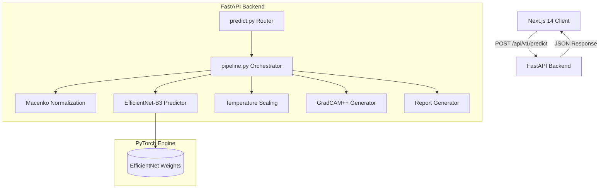

# OncoMouth Architecture

## System Diagram

## Folder Structure
- `backend/app`: Contains the strict Domain-Driven Design layout (`api`, `config`, `ml`, `services`).
- `backend/app/ml`: Separates models, preprocessing, calibration, and explainability.
- `frontend/src`: Next.js App Router, grouped by `features`, `hooks`, and `services`.
